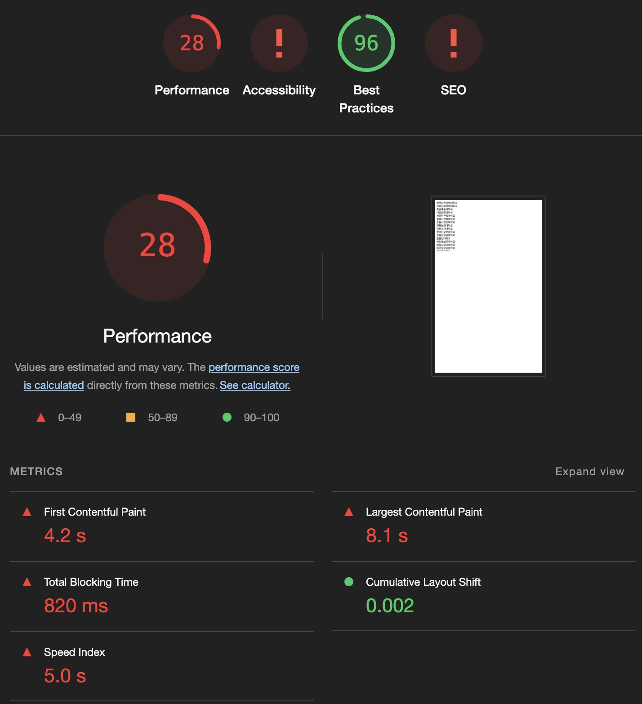
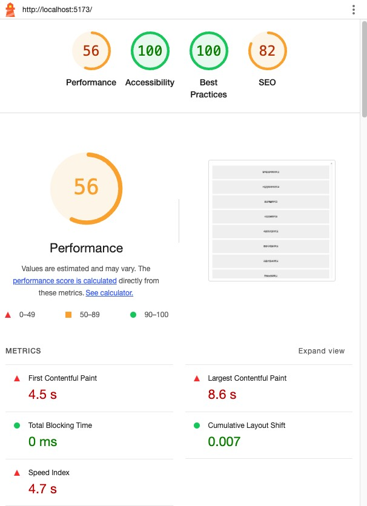
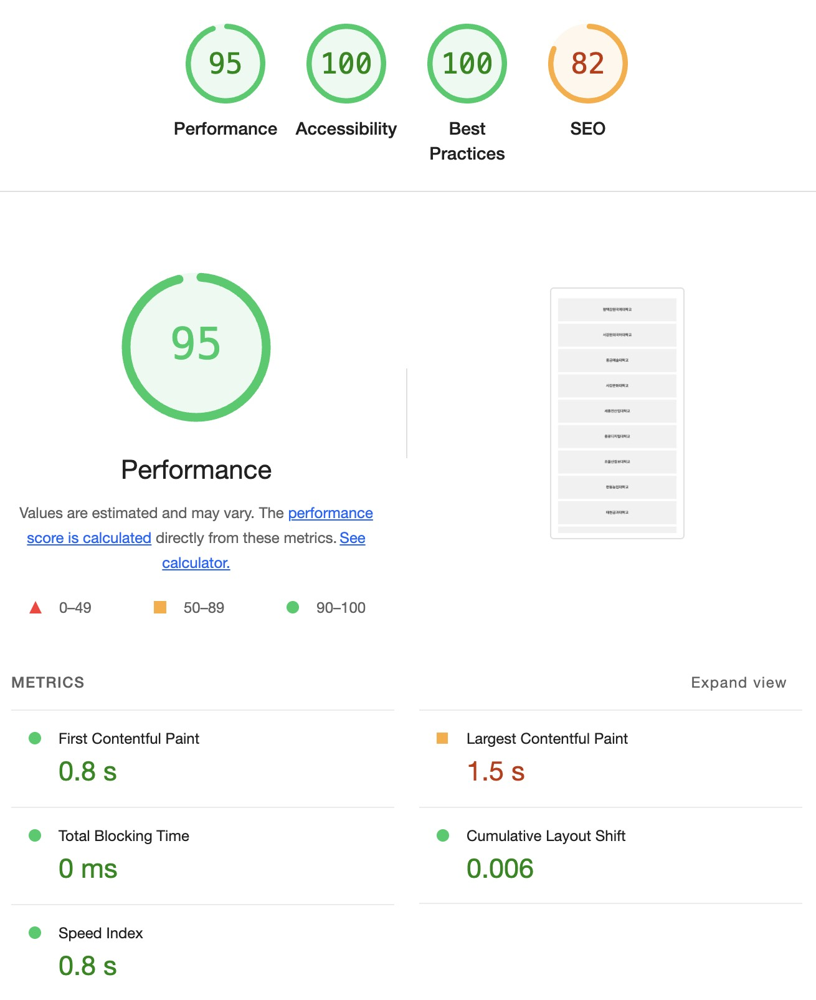

# 🚀 가상스크롤(virtual-scroll)

## 📌 소개
가상스크롤은 유저 입장에서 직접 보이는 요소들만 렌더링하고, 스크롤에 가려지는 부분은 렌더링 하지 않는 프론트엔드 최적화기법입니다. 그려야 하는 DOM의 개수가 수천, 수만단위가 넘어간다면 과부화가 생겨 무리가 갈 수 있습니다.

## 🎯 목표
- 가상스크롤을 위한 라이브러리가 많지만 (예: react-window, react-virtualized) 저희는 직접 개발해보았습니다.
- 15만개의 리스트를 화면에 전체렌더링하지 않고 뷰포트에서 보이는 부분만 렌더링하는 형식으로 구현했습니다.

## 📂 주요 기술 및 라이브러리
- react
- tanstack-query : 서버데이터관리
- styled-component: 스타일링
- react-use: 브라우저 뷰포트 크기 및 스크롤 상태 추적 (useWindowSize, useWindowScroll)
- MSW: API에 대한 응답을 모킹(mocking)해주는 라이브러리

## 🛠️코드의 작동 원리
1️⃣ 데이터 호출 및 기본 상태
- TanStack Query를 사용해 getSchoolList API로 학교 목록 데이터를 호출합니다.
- staleTime을 24시간으로 설정해 데이터를 자주 갱신하지 않도록 최적화했습니다.
- 호출된 데이터는 schoolList?.data에 저장됩니다.
  
2️⃣ 뷰포트 위치 및 스크롤 상태 계산
- useWindowScroll: 현재 스크롤 위치 (y)를 가져옵니다.
- useRef + getBoundingClientRect: scrollRef 요소의 **뷰포트 시작 위치 (viewportY)**를 구합니다.
- **relativeY**는 스크롤 위치와 viewportY의 차이로, 현재 요소의 상대적 스크롤 위치를 나타냅니다.
  
3️⃣ 보이는 항목의 인덱스 계산 (Virtual Scrolling)
- startIndex: 뷰포트에서 첫 번째로 보이는 항목의 인덱스를 계산합니다.
→ 내림(Math.floor) 처리를 통해 항목이 부분적으로 보이더라도 시작점으로 간주합니다.
- endIndex: 뷰포트에서 마지막으로 보이는 항목의 인덱스를 계산합니다.
→ 올림(Math.ceil) 처리를 통해 항목이 조금이라도 보이면 완전히 렌더링되도록 합니다.
**Math.max와 Math.min**은 음수 인덱스 방지 및 데이터 초과 방지를 위해 사용합니다.
- 
4️⃣ 보이는 항목 추출 및 위치 조정
visibleItem 추출
- **schoolList?.data.slice**로 현재 보이는 항목만 잘라서 렌더링합니다.
**translateY**로 첫 번째 항목의 렌더링 시작 위치를 조정합니다.
- 이 값은 startIndex에 해당하는 높이로 설정됩니다.
  
5️⃣ 렌더링
- SchoolList 요소에 전체 컨테이너 높이(containerHeight)를 설정해 가상 스크롤의 영역을 정의합니다.
- transform: translateY(${translateY}px)를 사용해 보이는 항목만 원하는 위치에 렌더링합니다.

## 🛠️성능 측정

        
          
        

