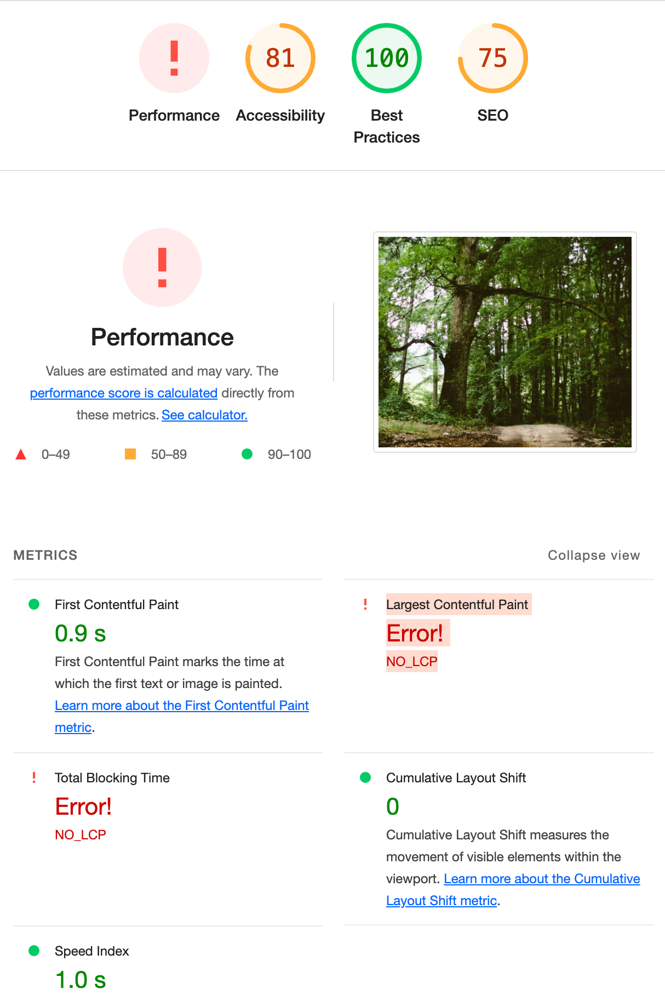

# 🚀 이미지 레이지로딩
## ✏️ 개요
최신 HTTP Archive data에 따라서, 이미지는 전체 페이지 크기에서 대략 45%를 차지합니다. 이미지를 웹 페이지를 없앨 수는 앖기 때문에, 이미지를 그대로 쓰면서 웹 페이지를 빠르게 로딩할 수 있는 방법을 찾아야합니다. 해당 레포지토리는 기존의 모든 이미지를 그대로 유지한 채 페이지 사이즈를 줄이고 페이지 로딩 시간을 향상시킬 수 있는 기술인 Images laze loading 기술에 대해 다루고 있습니다.

## 📌 소개
페이지 안에 있는 실제 이미지들이 화면에 보여질 필요가 있을 떄 로딩을 할 수 있도록 하는 테크닉이며 바로 로딩되는것이 아니라 로딩시점을 뒤로 미루는 기술입니다. 만약 사용자가 스크롤을 하지 않으면 보여지지 않은 이미지는 절대 로딩되지 않습니다.

## 🎯 목표
현재 고화질의 이미지 100장이 페이지내에 렌더링 되어지고 있으며 현재 성능이 측정되어지지 않고 있습니다, 레이지로딩기법과 기타기법을 활용해 성능향상을 목표로 하고있습니다

## 📂 주요 기술 및 라이브러리
- react

## 🛠️코드의 작동 원리
1️⃣
  
2️⃣ 
  
3️⃣ 

4️⃣
  
5️⃣ 

## 🛠️성능 측정

  

