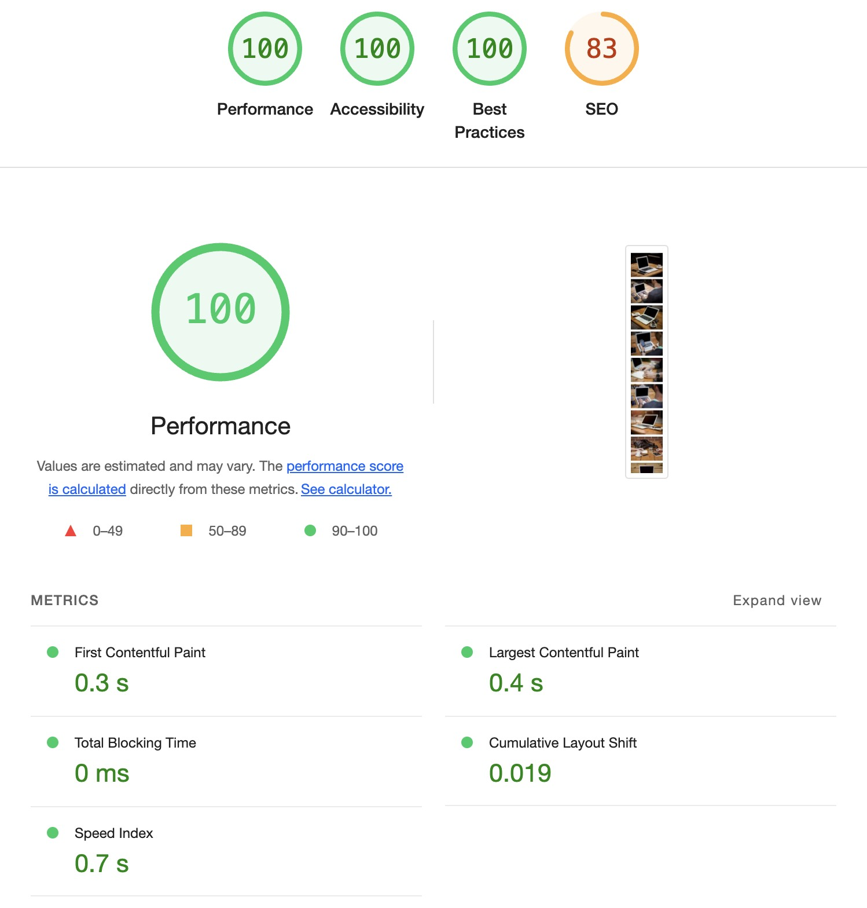

# 🚀 이미지 레이지로딩

## ✏️ 개요

이미지는 전체 페이지 크기에서 대략 45%를 차지합니다. 이미지를 웹 페이지를 없앨 수는 없기 때문에, 이미지를 그대로 쓰면서 웹 페이지를 빠르게 로딩할 수 있는 방법을 찾아야합니다. 해당 레포지토리는 기존의 모든 이미지를 그대로 유지한 채 페이지 사이즈를 줄이고 페이지 로딩 시간을 향상시킬 수 있는 기술인 Images laze loading 기술에 대해 다루고 있습니다.

## 📌 소개

페이지 안에 있는 실제 이미지들이 화면에 보여질 필요가 있을 떄 로딩을 할 수 있도록 하는 테크닉이며 바로 로딩되는것이 아니라 로딩시점을 뒤로 미루는 기술입니다. 만약 사용자가 스크롤을 하지 않으면 보여지지 않은 이미지는 절대 로딩되지 않습니다.

## 🎯 목표

이 LazyImage 컴포넌트는 Intersection Observer API를 활용하여 지연 로딩(Lazy Loading) 을 구현하는 React 컴포넌트입니다.
즉, 이미지가 화면에 나타날 때만 로드되도록 최적화하여 초기 페이지 로딩 속도를 개선하는 역할을 합니다.
해당 프로젝트에서는 뷰포트 외의 이미지는 더미이미지를 적용하여 우선적으로 뷰포트의 이미지를 로드되게끔 만들어 성능개선을 진행하였습니다.

## 📂 주요 기술 및 라이브러리

- react
- IntersectionObserver api

## 🛠️코드의 작동 원리

1️⃣ 처음에는 기본 이미지(예: "이미지 없음" 또는 회색 박스)를 보여줌

2️⃣ 이미지가 화면에 나타날 때만 로드 감시 시작

3️⃣ 이미지가 화면에 나타나면 실제 이미지로 변경

4️⃣ 중요한 이미지는 더 빨리 로드하도록 설정 가능

## 🛠️성능 측정

  
  

