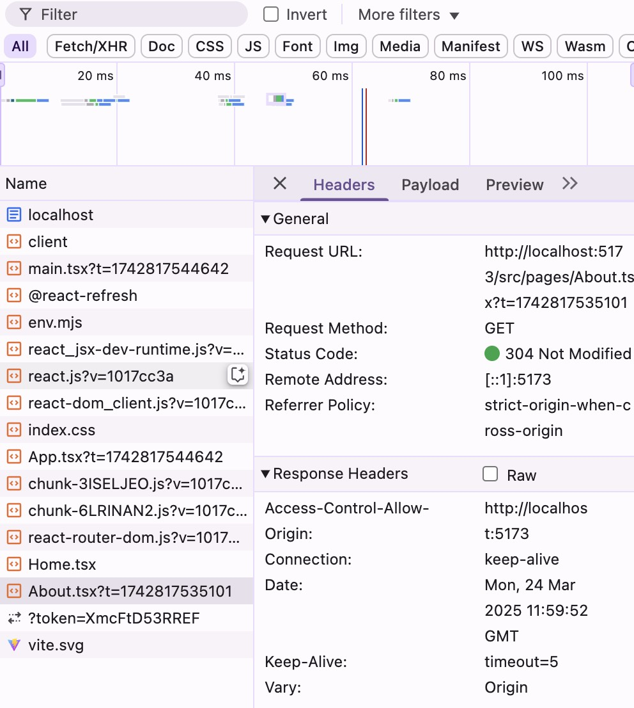
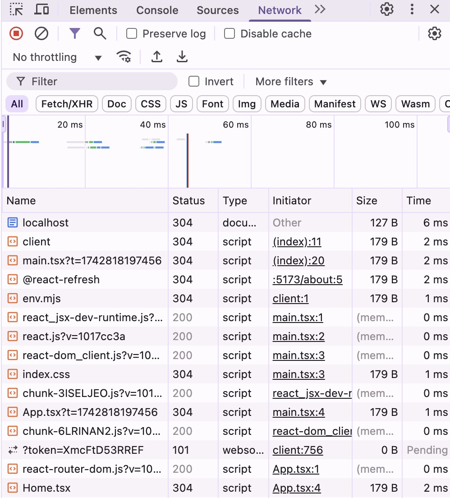

# 🚀 코드 스플리팅

## ✏️ 개요
리액트 어플리케이션의 경우 빌드를 통해서 배포한다. 이 과정에서 파일 크기를 가능하면 최소화하는 것이 바람직하다.

## 📌 소개
### 파일을 분리하는 과정
/, /about 으로 이루어진 SPA을 개발했을때 /일 경우 /about 페이지 정보는 사용자에게 보여질 필요가 없다

💡 그러한 파일들을 분리하여 지금 사용자에게 필요한 파일만 불러올 수가 있다면 로딩도 빠르게 이루어지고 트래픽도 줄어 사용자 경험이 좋아질 수가 있다.
지금 당장 필요한 코드가 아니면 따로 분리시켜서, 나중에 필요할 때 불러와서 사용할 수 있다.

**## 🎯 목표**

## 📂 주요 기술 및 라이브러리
1️⃣ React.lazy()

React.lazy()는 동적으로 컴포넌트를 불러올 수 있게 해주는 함수입니다. 기본적으로 컴포넌트가 처음 필요할 때 로딩되며, 이는 코드 스플리팅을 통해 애플리케이션의 초기 로딩 성능을 개선합니다.

2️⃣ Suspense

**Suspense**는 lazy()로 로딩되는 컴포넌트를 감싸주는 역할을 합니다. 컴포넌트가 로딩되는 동안 사용자에게 로딩 상태를 보여주기 위해 사용됩니다.

## 🛠️코드의 작동 원리
1️⃣ 초기로딩:
- 처음에 애플리케이션이 로딩되면, Home과 About 컴포넌트는 lazy()로 동적으로 로딩되기 전까지 화면에 표시되지 않습니다.

- Suspense는 컴포넌트가 로딩되는 동안 "Loading..." 메시지를 화면에 표시합니다.

2️⃣ URL 변경 시 라우팅:

- 사용자가 URL을 /로 변경하면, BrowserRouter는 이를 감지하고 / 경로에 해당하는 Home 컴포넌트를 렌더링합니다. 이때 Home 컴포넌트는 lazy()로 동적으로 로딩되므로 로딩이 완료될 때까지 "Loading..." 메시지가 표시됩니다.

- 사용자가 URL을 /about로 변경하면, BrowserRouter는 이를 감지하고 /about 경로에 해당하는 About 컴포넌트를 렌더링합니다. About 컴포넌트도 lazy()로 로딩됩니다.

## 🛠️성능 측정

  
  

