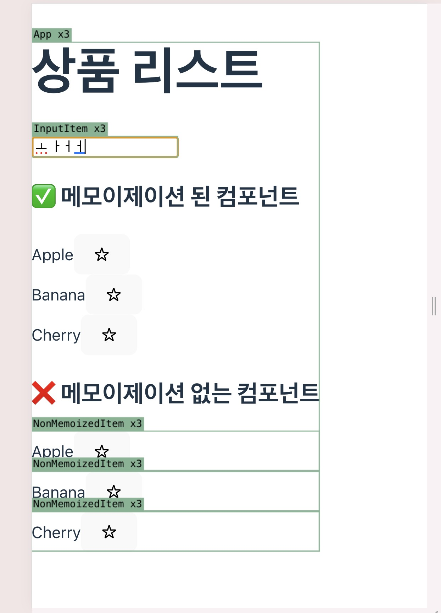

# 📦 React 렌더링 최적화 실험: React.memo + useCallback
이 프로젝트는 React에서 자식 컴포넌트의 불필요한 리렌더링을 방지하는 패턴을 실험하기 위해 만들어졌습니다.
두 가지 핵심 기술을 비교합니다:
- React.memo로 컴포넌트를 메모이제이션
- useCallback으로 함수 참조 유지

### 📁 구성
✅ useCallback을 이용해 만든 함수
````javascript
const toggleFavorite = useCallback((id) => {
  // ...
}, []);
````
React 컴포넌트는 리렌더링될 때마다 함수 내부에서 정의된 모든 함수가 다시 만들어지는 특성이 있음.
toggleFavorite이 메모이제이션 되면 컴포넌트가 리렌더링이 되어도 이 함수 객체를 다시만들지 않고 그 함수 객체를 계속 **재사용**

✅ MemoizedItem 컴포넌트
````javascript
const MemoizedItem = memo(function MemoizedItem({ item, onToggle }) {
  console.log(`✅ MemoizedItem 렌더링: ${item.name}`);
  return (
    <div>
      <span>{item.name}</span>
      <button onClick={() => onToggle(item.id)}>
        {item.favorite ? "★" : "☆"}
      </button>
    </div>
  );
});
````
1. React.memo를 사용해 props가 바뀌지 않으면 리렌더링을 방지힘
2. item이 변경된 경우에만 리렌더링됨 (shallow comparison)


❌ NonMemoizedItem 컴포넌트
````javascript
function NonMemoizedItem({ item, onToggle }) {
  console.log(`🔁 NonMemoizedItem 렌더링: ${item.name}`);
  return (
    <div>
      <span>{item.name}</span>
      <button onClick={() => onToggle(item.id)}>
        {item.favorite ? "★" : "☆"}
      </button>
    </div>
  );
}
````
memo를 사용하지 않기 때문에 부모가 리렌더링되면 무조건 리렌더링됨

### 📁 비교

