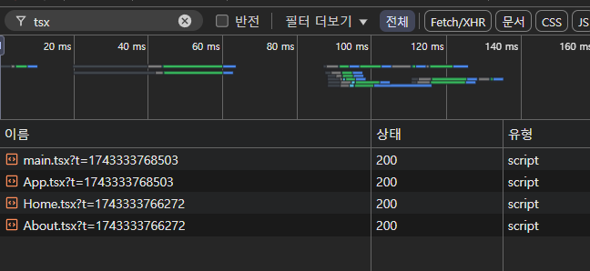
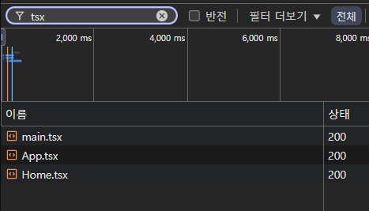

# 🎩 코드 스플리팅

## 🎈 개요
SPA를 사용하는 경우 보통 번들링 과정을 통해 하나의 커다란 파일을 생성하게 된다.이를 통해 아래의 장점을 얻을 수 있게 된다.
- 요청 한번으로 번들링 된 파일을 가져오기 때문에 이후 요청 횟수 감소로 인한 전체적인 트래픽 감소

<br />

하지만 하나의 번들링 과정을 통해서 현재 페이지에서 필요하지 않은 다른 모든 데이터를 한번에 가져오기 때문에 초기 로딩 속도가 느려지는 단점이 존재한다.

<br />

이러한 문제를 해결할 수 있는 방법이 코드 스플리팅이다. 번들링에 포함되지 않을 파일들을 선별하여 제외하고, 실제 사용되는 시점에 코드를 불러오도록 한다.

<br/>

## 🎁 사용하기
`React.lazy`를 사용하면 페이지를 동적으로 임포트 해올 수 있다. 아래와 같이 React.lazy를 통해 동적 임포트 된 컴포넌트를 활용할 수 있다.
```
const Home = React.lazy(() => import(./Home));

const MyComponent = () => {
  return (
    <Suspnse fallback={<div>Loding...</div>}>
      <Home />
    </Suspnse>
  );
}
```


<br/>

## 🎄 결과 확인
### 개선전
개선전에는 현재 페이지에서 사용하지 않는 About 페이지까지 모두 로드 되고 있다.


<br />

### 개선후
개선 후에는 현재 페이지에서 사용하지 않는 About 페이지는 로드하지 않는다.


<br/>

## 🎊 결론
코드 스플리팅은 실제 사용되는 페이지에 해당하는 파일만 요청함으로 써 초기 로딩 속도를 빠르게 개선할 수 있다. 하지만 달리말하면 다른 페이지 이동 시에는 새로운 요청을 받아와야하기 때문에 더 느린 속도가 된다. 즉, 모든 페이지에 코드 스플리팅을 적용하는 것은 좋은 선택이 아니다. 

<br />

> 로딩 속도에 큰 영향을 줄 수 있는 부분에만 적절히 코드 스플리팅을 사용하자

